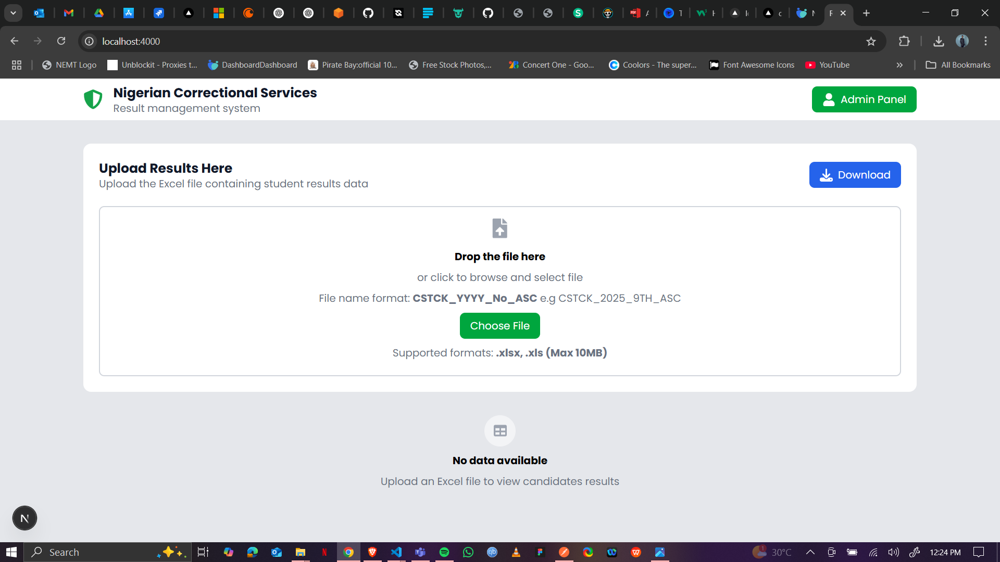

# Nigerian Correctional Services Result Management System 

## Overview


This project is a Next.js web-based application for managing correctional services results. It provides a user-friendly interface for students to view and download their correctional services results.

## Installing and Running the Project Locally
- Step 1: Clone the Repository
Clone the repository using your preferred method (HTTPS or SSH). If you're new to Git, you can download the repository as a ZIP file.
```bash
git clone https://github.com/bube054/candidate-grading-system.git
```
- Step 2: Install Dependencies
Make sure you have [Node.js](https://nodejs.org/en/download) installed on your system. Navigate to the project directory and install the dependencies using npm:
```bash
npm install
```

- Step 3: Start the Development Server
Start the development server by running:
```bash
npm run dev
```

This will start the development server on http://localhost:4000. You can now access the application in your web browser.

- Step 4: Build and Start the Production Server (Optional)
If you want to test the production build, you can run:
```bash
npm run build
```
Then, start the production server:
```bash
npm start
```

## Features
- Upload Excel File
- View Results in a table format
- Search Results
- Download Results as a PDF file or batch of zipped PDF files